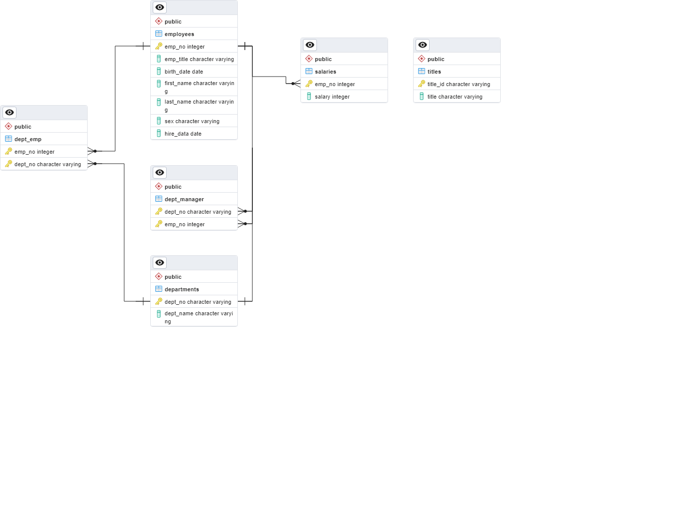

# sql-challenge
Module 9 - SQL challenge

The objective of this challenge was to create a SQL database using the CSV files provided from Pewlett Hackard. The files had to be analyzed to understand how to setup the tables in terms of the number of columns, names of columns, data types for each, and determine which values needed to be set at the keys for each table.

I started by creating the tables with just the column names and data types. Once I had all of the columns created for each table I used the Entity Relationship Diagram (ERD) tool in pgAdmin to look at all of the tables together. This helped me visualize the connections between each table and to decide how to establish the primary and foreign key relationships. Once I had a clear understanding of the tables I revised the tables with the final schema.

Once the tables were created I imported the CSV files into their respective tables and began the data analysis portion. The analysis was pretty straight forward. The biggest hurdle was properly setting up the double JOIN operations. Once I completed that each analysis step was fairly straightforward.

